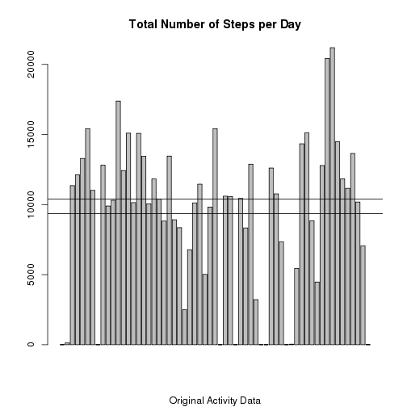

# Reproducible Research: Peer Assessment 1

## Loading and preprocessing the data
Unzip the data file and read the .csv data into "activity" data.frame<br/>
Convert date strings to an additional date type variable<br/>
Calculate missing step values vector

```r
library(utils)
unzip("activity.zip")
activity <- read.csv("activity.csv")
activity$dated <- as.Date(activity$date, "%Y-%m-%d")
str(activity)
```

```
## 'data.frame':	17568 obs. of  4 variables:
##  $ steps   : int  NA NA NA NA NA NA NA NA NA NA ...
##  $ date    : Factor w/ 61 levels "2012-10-01","2012-10-02",..: 1 1 1 1 1 1 1 1 1 1 ...
##  $ interval: int  0 5 10 15 20 25 30 35 40 45 ...
##  $ dated   : Date, format: "2012-10-01" "2012-10-01" ...
```

```r
head(activity)
```

```
##   steps       date interval      dated
## 1    NA 2012-10-01        0 2012-10-01
## 2    NA 2012-10-01        5 2012-10-01
## 3    NA 2012-10-01       10 2012-10-01
## 4    NA 2012-10-01       15 2012-10-01
## 5    NA 2012-10-01       20 2012-10-01
## 6    NA 2012-10-01       25 2012-10-01
```

```r
missing_vector <- is.na(activity$steps)
```
Instantiate Histogram, Mean and Median reporting Function

```r
# Function to:
#  Aggregate steps, calculate total number of steps each day
#  Calculate the mean and median total number of steps per day
#  produce histogram
histogram <- function(x, sub) {
    sums <- with(x, aggregate(steps, list(date), sum, na.rm=TRUE))
    names(sums) <- c("Date", "TotalSteps")
    mean_steps <- mean(sums$TotalSteps, na.rm=TRUE)
    median_steps <- median(sums$TotalSteps, na.rm=TRUE)
    message(sprintf("Mean total number of steps per day: %f", mean_steps))
    message(sprintf("Median of total number of steps per day: %f", 
                                                            median_steps))
    barplot(sums$TotalSteps, main="Total Number of Steps per Day", sub=sub)
    abline(a=mean_steps, b=0)
    abline(a=median_steps, b=0)
}
```

Instantiate Imputing function, will use the function specified, median is 
default

```r
# Function to imput missing step data by using specified function on values
#  from the same interval
# Takes as input:
#  x which is the data frame containg the activity data
#  func which specifies the aggregation function
# Returns:
#  data frame like original but with imputed values for steps where 
#    steps were NA
imputByInterval <- function(x, func="median") {
    
    #if (func=="median") {
        interval_steps <- with(x, aggregate(steps, list(interval), 
                                    func, na.rm=TRUE))
    #} else {
    #    interval_steps <- with(x, aggregate(steps, list(interval), 
    #                                func,   na.rm=TRUE))
    #}
    names(interval_steps) <- c("interval", "steps")

    activity_imputed <- x

    for(i in 1:nrow(x)) {
        if (missing_vector[i]) {
           activity_imputed$steps[i] <- 
              interval_steps$steps[which(interval_steps$interval==x$interval[i])]
        }
    }
    return(activity_imputed)
}
```

## What is mean total number of steps taken per day?

```r
histogram(activity, sub="Original Activity Data")
```

```
## Mean total number of steps per day: 9354.229508
## Median of total number of steps per day: 10395.000000
```

 

## What is the average daily activity pattern?

```r
intervals <- with(activity, aggregate(steps, list(interval), mean, na.rm=TRUE))
head(intervals)
```

```
##   Group.1       x
## 1       0 1.71698
## 2       5 0.33962
## 3      10 0.13208
## 4      15 0.15094
## 5      20 0.07547
## 6      25 2.09434
```

```r
names(intervals) <- c("Interval", "AverageSteps")
plot(intervals$AverageSteps, main="Average Daily Activity Pattern", type="l")
```

 

```r
#using the interval number as x distorts the time series as the interval numbers
#are not evenly spaced
#plot(intervals$Interval, intervals$AverageSteps, 
#     main="Average Daily Activity Pattern v. Interval Value", type="l")

max_interval_index <- which(intervals$AverageSteps==max(intervals$AverageSteps))
interval <- intervals$Interval[max_interval_index]
sprintf("On average, the maximum interval index is: %d", max_interval_index)
```

```
## [1] "On average, the maximum interval index is: 104"
```

```r
sprintf("........ this is interval: %d", interval)
```

```
## [1] "........ this is interval: 835"
```

The 5 minute interval, which on average across all the days in the dataset, 
contains the maximum number of steps is: 835

## Imputing missing values
Calculate the number of missing values</br>
Will calculate the mean and median values for the 5 minute intervals and will use 
those values in place of the missing values.

```r
missing <- sum(missing_vector)
activity_imputed <- imputByInterval (activity, func="mean")
missing_vector2 <- is.na(activity_imputed$steps)
missing2 <- sum(missing_vector2)
```
There are 2304 missing step values in the orginal data set.</br>
After imputing using means, there are 0 missing step values in the imputed data set.


```r
histogram(activity_imputed, "Interval Steps Imputed with Means")
```

```
## Mean total number of steps per day: 10766.188679
## Median of total number of steps per day: 10766.188679
```

 


```r
missing <- sum(missing_vector)
activity_imputed <- imputByInterval (activity, func="median")
missing_vector2 <- is.na(activity_imputed$steps)
missing2 <- sum(missing_vector2)
```
There are 2304 missing step values in the orginal data set.</br>
After imputing using medians, there are 0 missing step values in the imputed data set.


```r
histogram(activity_imputed, "Interval Steps Imputed with Medians")
```

```
## Mean total number of steps per day: 9503.868852
## Median of total number of steps per day: 10395.000000
```

 

## Are there differences in activity patterns between weekdays and weekends?


```r
xx <- transform(activity_imputed, 
    weekend = ifelse(
        weekdays(activity_imputed$dated) %in% c("Sunday", "Saturday"),
                     "weekend", "weekday"))
interval_weekend <- with(xx, aggregate(steps, list(interval, weekend), mean, 
                                       na.rm=TRUE))
names(interval_weekend) <- c("interval", "weekend", "steps")
library(lattice)
```

```
## 
## Attaching package: 'lattice'
## 
## The following object is masked _by_ '.GlobalEnv':
## 
##     histogram
```

```r
xyplot(steps ~ interval | weekend, data=interval_weekend, layout=c(1,2),
       type="l")
```

 
