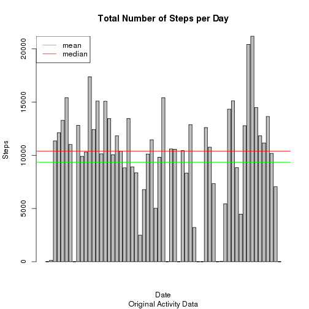
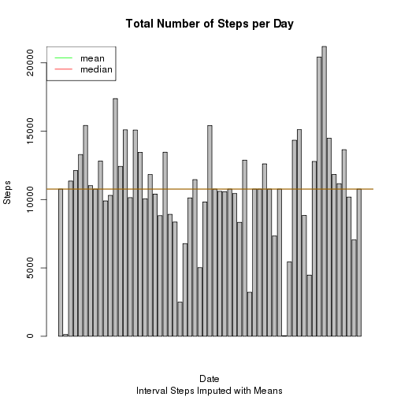

# Reproducible Research: Peer Assessment 1
 
## Loading and preprocessing the data

Goals:

1. Load the data
1. Process/transform the data

Process points:
* Unzip the data file
* Read the .csv data into "activity" data.frame
* Convert date strings to an additional date type variable
* Calculate missing step values vector
* Instatiate functions

```r
library(utils)
library(stats)
library(plyr)
unzip("activity.zip")
activity <- read.csv("activity.csv")
activity$dated <- as.Date(activity$date, "%Y-%m-%d")
# str(activity)
# head(activity)
# Calculte vector of missing step values
missing_vector <- is.na(activity$steps)
# setup vectors to store means and medians for comparisons
means <- c(0, 0, 0)
medians <- c(0, 0, 0)
```
Instantiate Histogram, Mean and Median reporting Function.

```r
# Function to:
#  Aggregate steps, calculate total number of steps each day
#  Calculate the mean and median total number of steps per day
#  produce histogram
# Takes as input:
#  x the dataframe containing the activity data
#  sub the subtitle to the histogram to identify it
#  calc the calculation index of where to store the resultant mean and medians
#  "prints" the mean and median values of the steps per day
histogram <- function(x, sub, calc=1) {
    #find the total number of steps per day, store in sums
    sums <- with(x, aggregate(steps, list(date), sum, na.rm=TRUE))
    names(sums) <- c("Date", "TotalSteps")
    
    #>>>> this may or may not be what was requested.... for mean and median
    # What does "... mean and median total number of steps taken per day" mean?
    
    means[calc] <<- mean(sums$TotalSteps, na.rm=TRUE)
    medians[calc] <<- median(sums$TotalSteps, na.rm=TRUE)
    message(sprintf("Mean total number of steps per day: %f", means[calc]))
    message(sprintf("Median of total number of steps per day: %f", 
                    medians[calc]))
    
    #>>>> see if there's a clarification in the discussion groups
    # Consider:
    # ag <- aggregate(len ~ ., data = ToothGrowth, mean)
    # xtabs(len ~ ., data = ag)
    
    barplot(sums$TotalSteps, main="Total Number of Steps per Day", sub=sub)
    abline(a=means[calc], b=0)
    abline(a=medians[calc], b=0)
}
```

Instantiate Imputing functions, based on intervals it will use the function 
specified, median is default.

```r
# Functions used to impute values for steps
# Take as input:
#  x which is the variable to impute
#  returns the calculated value to use as imputed value
# used in conjunction with ddply which does the split, calc, and combine
imputeMean <- function(x) replace(x, is.na(x), mean(x, na.rm=TRUE))
imputeMedian <- function(x) replace(x, is.na(x), median(x, na.rm=TRUE))
#
# Function to imput missing step data by using specified function on values
#  from the same interval
# Takes as input:
#  x which is the data frame containg the activity data
#  func which specifies the aggregation function
# Returns:
#  data frame like original but with imputed values for steps where 
#    steps were NA
imputByInterval <- function(x, func="median") {
    if (func=="mean")
        y <- ddply(x, ~ interval, transform, steps = imputeMean(steps))
    else 
        y <- ddply(x, ~ interval, transform, steps = imputeMedian(steps))  
    
    return(y)
}
```

## What is mean total number of steps taken per day?
Goals:

1. Make a histogram of the total number of steps taken each day
1. Calculate and report the mean and median total number of steps taken each
day

Process points:

(all while ignoring missing data)
* Using the original activity data, plot the total steps per day 
* Calculate and display mean and medians


```r
histogram(activity, sub="Original Activity Data", 1)
```

```
## Mean total number of steps per day: 9354.229508
## Median of total number of steps per day: 10395.000000
```

 

## What is the average daily activity pattern?

Goals:

1. Make a time series plot of the 5-minute interval (x-axis) and the average
number of steps taken, averaged across all days (y-axis)
1. Which 5-minute interval, on average across all the days in the dataset, contains the maximum number of steps?

Process points:
* Calculate the average number of steps per interval and store in dataset
'intervals'
* Line plot the result x, y (intervals, steps).  See note about picking the x 
axis variable
* Determine which interval has the maximum average steps
* Report both the interval index and value

```r
intervals <- with(activity, aggregate(steps, list(interval), mean, na.rm=TRUE))
names(intervals) <- c("Interval", "AverageSteps")
head(intervals)
```

```
##   Interval AverageSteps
## 1        0      1.71698
## 2        5      0.33962
## 3       10      0.13208
## 4       15      0.15094
## 5       20      0.07547
## 6       25      2.09434
```

```r
# plot(intervals$AverageSteps, main="Average Daily Activity Pattern", type="l")
#using the interval number as x distorts the time series as the interval numbers
#are not evenly spaced, I believe a better choice would be the plot call just 
#above this comment 

plot(intervals$Interval, intervals$AverageSteps, 
     main="Average Daily Activity Pattern", type="l")
```

 

```r
max_interval_index <- which(intervals$AverageSteps==max(intervals$AverageSteps))
interval <- intervals$Interval[max_interval_index]
sprintf("On average, the maximum number of steps is in interval index: %d", 
        max_interval_index)
```

```
## [1] "On average, the maximum number of steps is in interval index: 104"
```

```r
sprintf("........ this is interval: %d", interval)
```

```
## [1] "........ this is interval: 835"
```

The 5 minute interval, which on average across all the days in the dataset, 
contains the maximum number of steps is: 835.

## Imputing missing values
I wanted to compare using two methods of imputing the missing step numbers, 
mean/interval and median/interval.  Both are listed here.

Goals:

1. Calculate and report the total number of missing values in the dataset
1. Devise a strategy for filling in all the missing values in the dataset
1. Create a new dataset that is equal to the original dataset but with missing
data filled in
1. Make a histogram of the total number of steps taken each day and calculate 
and report the mean and median total number of steps taked per day.  Do these 
values differ than the estimates from above? What is the impact of imputing 
missing data on the estimates of total daily number of steps.

Processing points:
* Calculate the number of missing values. 
* We will calculate the mean and median values for the 5 minute intervals and 
will use those values in place of the missing step values; **the new dataset is 
'activity_imputed'**. 
* Compare overall mean and median values of the resulting imputed datasets.
* We'll then compare the results of imputing both ways by comparing the 
plotting of the histogram (compare step totals between the two imputing models
and the original histogram)

**_First_** imput using the mean per interval:


```r
missing <- sum(missing_vector)
activity_imputed <- imputByInterval (activity, func="mean")
missing_vector2 <- is.na(activity_imputed$steps)
missing2 <- sum(missing_vector2)
```
There are 2304 missing step values in the orginal data set.

After imputing using means per interval, there are 0 missing step 
values in the imputed data set.


```r
histogram(activity_imputed, "Interval Steps Imputed with Means", 2)
```

```
## Mean total number of steps per day: 10766.188679
## Median of total number of steps per day: 10766.188679
```

 

**_Second_** imput using the median per interval:


```r
missing <- sum(missing_vector)
activity_imputed <- imputByInterval (activity, func="median")
missing_vector2 <- is.na(activity_imputed$steps)
missing2 <- sum(missing_vector2)
```
There are 2304 missing step values in the orginal data set.

After imputing using medians per interval, there are 0 missing step 
values in the imputed data set.


```r
histogram(activity_imputed, "Interval Steps Imputed with Medians", 3)
```

```
## Mean total number of steps per day: 9503.868852
## Median of total number of steps per day: 10395.000000
```

 

Looking at the results of both imputing functions it looks like:

* Using the mean steps per interval gave us a change in mean from 
9354.2295 to 1.0766 &times; 10<sup>4</sup> and a change of median of from 1.0395 &times; 10<sup>4</sup> to 
1.0766 &times; 10<sup>4</sup>
* Using the median steps per interval gave us a change in mean from 
9354.2295 to 9503.8689 and a change of median of from 1.0395 &times; 10<sup>4</sup> to 
1.0395 &times; 10<sup>4</sup>
* The histogram of the total number of steps changed the most with imputing the 
missing values using the interval means v the interval medians

## Are there differences in activity patterns between weekdays and weekends?

Will use the last imputed data (using interval medians)

Goals:

1. Create a new factor variable in the dataset with two levels -- "weekday" 
and "weekend" indicating whether a given date is a weekday or weekend day.
1. Make a panel plot containing time series plots of the 5-minute interval
(x-axis) and the average number of steps taken, averaged across all weekday days or weekend days (y-axis).

Processing points:
* Using the transform function introduce a factor variable, weekend, that takes
on the values of "weekday" or "weekend" based upon the date of the observation.
* Aggregate the steps based on interval and weekday/weekend and name the
variables appropriately.
* Produce a panel plot of steps ~ interval; one panel for weekend and one
for weekday.  We can then compare the plots


```r
xx <- transform(activity_imputed, 
                weekend = ifelse(
                weekdays(activity_imputed$dated) %in% c("Sunday", "Saturday"),
                     "weekend", "weekday"))
interval_weekend <- with(xx, aggregate(steps, list(interval, weekend), mean, 
                                       na.rm=TRUE))
names(interval_weekend) <- c("interval", "weekend", "steps")
library(lattice)
```

```
## 
## Attaching package: 'lattice'
## 
## The following object is masked _by_ '.GlobalEnv':
## 
##     histogram
```

```r
xyplot(steps ~ interval | weekend, data=interval_weekend, layout=c(1,2),
       type="l")
```

 

Examining the patterns for weekend v weekday, we see:
* About the same inactivity periods at the beginning of the day and end of day 
presumably due to the sleep cycle
* The daily weekend activity is delayed, perhaps due to "sleeping in"
* The weekend activity is greater during the day.  Perhaps the people sample 
had office workers who are more sedantary during the work week and are 
active on the weekends
